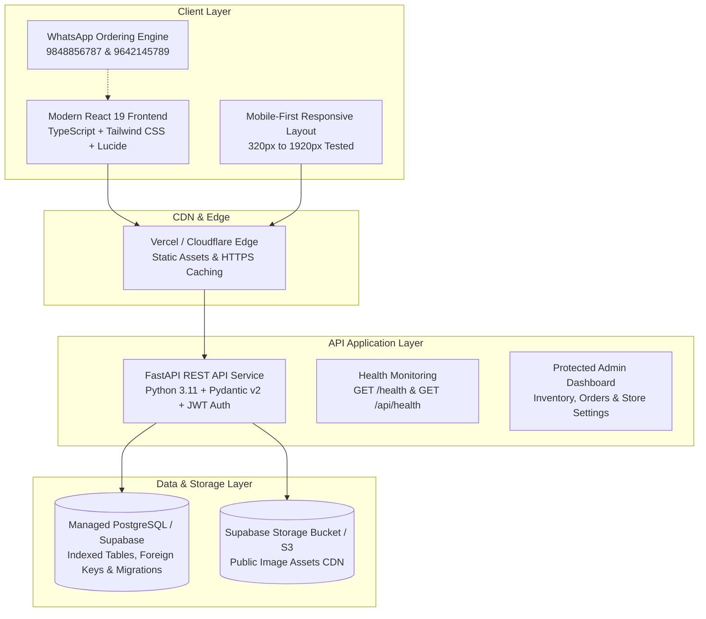

# Vaishno Karthik Dry Fruits, Spices & Cold Pressed Oils

> **Pure Goodness, Traditionally Crafted.**  
> A production-grade, scalable Indian e-commerce web application for premium dry fruits, nutrient edible seeds, authentic whole spices, wooden ghani cold-pressed oils, and handmade natural-jaggery sweets.

---

## 🏛️ System Architecture



---

## 🌟 Technology Stack

| Layer | Technologies Used |
| :--- | :--- |
| **Frontend** | React 19, TypeScript, Vite, Tailwind CSS v4, Lucide Icons, Canvas-Confetti |
| **Backend** | FastAPI, Python 3.11, Pydantic v2, Python-Jose (JWT), Passlib / Bcrypt |
| **Database** | PostgreSQL (Supabase-ready) / SQLite for instant local dev, SQLAlchemy 2.0 ORM, Alembic migrations |
| **Storage** | Supabase Storage / S3-compatible cloud object storage API |
| **Order Modes** | Cash on Delivery (COD), Direct WhatsApp Ordering, Razorpay/UPI gateway architecture |
| **Deployment** | Vercel / Netlify (Frontend), Render / Railway / Fly.io / Docker (Backend) |

> 🚫 **Zero Streamlit**: Built exclusively with an enterprise React SPA frontend and a high-performance Python FastAPI backend.

---

## 📦 Product Catalog (40 Initial Poster Products)

All 40 products from the business reference poster are seeded in the database with weights, pack variants, prices, Telugu names, and storage guidance:

1. **Nuts & Dry Fruits (12 Items)**:
   Badam (Almonds), Kaju (Cashews), Anjeer (Dried Figs), Walnuts (Akhrot), Pista, Salted Pista, Kismis (Golden Raisins), White Munakka, Black Munakka, Dry Dates (Kharik), Kimia Dates, Seedless Dates.

2. **Seeds & Whole Spices (19 Items)**:
   Pumpkin Seeds, Sunflower Seeds, Watermelon Seeds (Magaj), Chia Seeds, Sabja Seeds, Flax Seeds (Avise Ginjalu), Nuvvulu (Sesame), Dhaniyalu (Coriander), Jeera (Cumin), Lavangalu (Cloves), Dalchina Chekka (Cinnamon), Japathri (Mace), Elachi (Green Cardamom 8mm), Marati Mogga (Kapok Buds), Shadjeera, Biryani Leaf (Tej Patta), Menthulu (Fenugreek), Aavalu (Mustard), Anasapuvvu (Star Anise).

3. **Cold Pressed Oils (Wood Ghani / Marachekku - 3 Items)**:
   Palli Cold Pressed Oil (Groundnut), Sesame Cold Pressed Oil (Nuvvula Nune), Coconut Cold Pressed Oil (Kobbari Nune).

4. **Natural Jaggery Sweets (Zero White Sugar - 6 Items)**:
   Jowar Laddu (Sorghum), Ragi Laddu (Finger Millet), Nuvvula Laddu (Sesame & Bellam), Bellam Sunnundalu (Roasted Urad Dal & Desi Ghee), Flax Seed Laddu, Korra Laddu (Foxtail Millet).

---

## 🚀 Quick Start (Local Development)

### 1. Prerequisites
- **Python 3.10+**
- **Node.js 18+ & npm**

### 2. Backend Setup
```bash
# Navigate to backend and create virtualenv
python -m venv venv
.\venv\Scripts\activate       # Windows
# source venv/bin/activate    # Linux/macOS

# Install dependencies
pip install -r backend/requirements.txt

# Run migrations and seed database (all 40 products)
python backend/migrate.py

# Start local FastAPI server
uvicorn backend.app.main:app --reload --port 8000
```
Backend API will be running at `http://127.0.0.1:8000`.  
Interactive API Documentation: `http://127.0.0.1:8000/docs`.

### 3. Frontend Setup
```bash
# In a new terminal, navigate to frontend
cd frontend

# Install packages
npm install

# Start Vite development server
npm run dev
```
Frontend will be accessible at `http://localhost:5173`.

---

## 🔐 Credentials & Default Admin Access

| Role | Email | Password |
| :--- | :--- | :--- |
| **Store Manager / Admin** | `admin@vaishnokarthik.com` | `Admin@VK2026` |

*(Can be modified via `.env` or in the Admin Dashboard Settings tab).*

---

## 🧪 Automated Testing

The backend includes a comprehensive pytest suite covering API endpoints, health checks, product filtering, order creation, and admin authorization:

```bash
# Run test suite
pytest backend/tests/test_api.py -v
```

---

## 🌍 Production Deployment

For complete, step-by-step production deployment instructions (Vercel + Render + Supabase + Custom Domain + HTTPS), refer to:

👉 **[DEPLOYMENT.md](file:///f:/personal/DEPLOYMENT.md)**

---

## 📞 Official Store Contact Information
- **Primary Phone**: `+91 9848856787`
- **Secondary Phone**: `+91 9642145789`
- **WhatsApp Ordering**: `+91 9848856787`
- **Region**: Telangana & Andhra Pradesh, India
